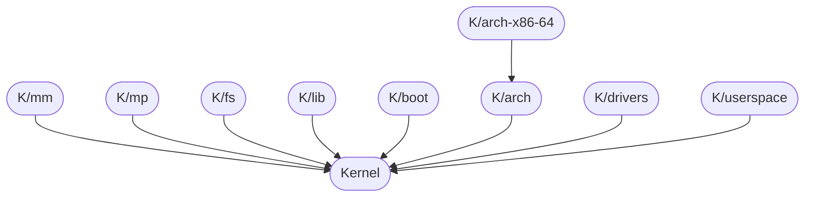

# Arctan Kernel 

## What
This is the kernel for the Arctan Operating System. The kernel is distributed among many smaller repositories. These
repositories can be found under K/. On Github, these smaller repositories take the form the of the module name (in lower
case), prefixed by 'K' (i.e. https://github.com/Arctan-OS/Kmm contains code relevant to memory management).

## Goal
A modular 64-bit kernel that is easy to change.

## Original Goal
A simple 64-bit operating system which is able to load programs into memory and store them to disk.

## Requirements
* gcc
* nasm
* binutils
